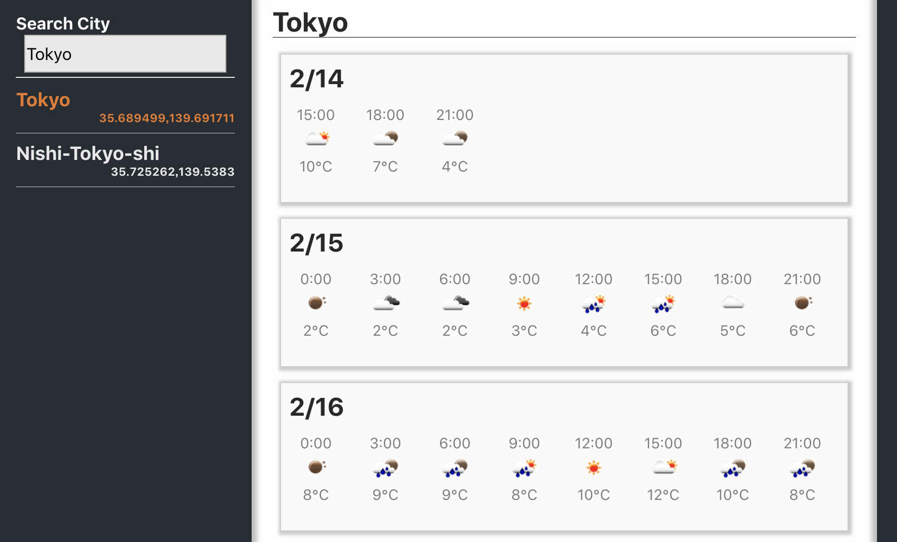

React Hooks example for practice, showing weather forecast using `Open Weather API`



# Preparing

## create api key

1. get API key from open weather
2. write API key to `.env` file, with named `REACT_APP_API_KEY`

example

```txt
REACT_APP_API_KEY="YOUR_KEY"
```

## create city list

For reducing json size, filter city.json as japan only.

1. download all cities from [Open weather](http://bulk.openweathermap.org/sample/), `citiy.list.json.gz`
2. extract .gz and move it to `tools/` folder
3. run python code in `tools/`, *python3 city_filter.py*
4. `jp_cities.json` will be craeted
5. move it to `src/city/` folder

